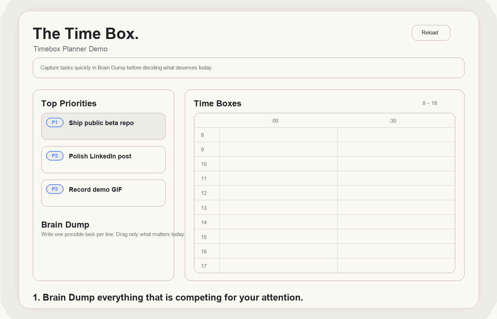

# Timebox Planner

`Timebox Planner`는 Obsidian Daily note 안에서 `Brain Dump -> Top Priorities -> Time Boxes`를 한 흐름으로 이어주는 데스크톱 전용 플러그인입니다.

새로운 일정 앱을 하나 더 여는 대신, 이미 매일 쓰는 노트 안에서 오늘 할 일과 시간을 함께 정리하는 데 초점을 맞췄습니다. 일반적인 캘린더 대체제가 아니라, Daily note 기반의 실행 루틴을 더 쉽게 만드는 작은 도구입니다.

## 왜 만들었나

- AI 덕분에 실행 속도는 빨라졌지만, 하루 우선순위는 더 쉽게 흐려졌습니다.
- 할 일 목록만 길어지는 대신, 오늘 실제로 쓸 시간을 먼저 고정하고 싶었습니다.
- 별도 도구가 아니라 Obsidian Daily note 안에서 바로 timeboxing 하고 싶었습니다.
- 개인용 생산성 도구이면서, 작은 팀에서 서로의 하루 맥락을 가볍게 공유하는 용도로도 쓰고 있습니다.

## 핵심 워크플로우

1. `Brain Dump`에 떠오르는 일을 한 줄씩 적습니다.
2. 오늘 반드시 밀어야 할 1~3개를 `Top Priorities`로 고릅니다.
3. 우측 30분 슬롯에 끌어 놓아 `Time Boxes`로 배치합니다.

## 현재 MVP 기능

- 우측 사이드바에 `Timebox Planner` 전용 뷰 열기
- `Top Priorities` 3칸 편집
- `Brain Dump` 항목 추가, 수정, 삭제
- `Brain Dump` 항목을 `Top Priorities`로 복사
- 카드 선택 후 빈 슬롯 클릭으로 빠른 배치
- 카드를 30분 슬롯으로 드래그해 블록 생성
- 수동 블록 생성, 이동, `+30` / `-30` 리사이즈, 삭제
- 활성 노트의 `Top Priorities` / `Brain Dump` 섹션과 플래너 데이터를 자동 동기화
- Markdown 본문을 사람이 읽을 수 있는 형태로 유지하면서, 추가 데이터는 숨은 주석으로 저장

## 설치 방법

현재는 수동 설치 방식만 지원합니다.

1. `manifest.json`, `main.js`, `styles.css`를 같은 폴더에 둡니다.
2. 해당 폴더를 `VaultFolder/.obsidian/plugins/timebox-planner/`에 넣습니다.
3. Obsidian에서 Community Plugins를 켜고 `Timebox Planner`를 활성화합니다.
4. 명령어 팔레트에서 `Open Timebox Planner`를 실행합니다.
5. Daily note를 연 상태에서 `Brain Dump -> Top Priorities -> Time Boxes` 흐름으로 사용합니다.

## 데이터 저장 방식

플러그인은 활성 노트 안에 다음 정보를 저장합니다.

- 사람이 읽는 섹션: `## Top Priorities`, `## Brain Dump`
- 기계가 읽는 데이터: `<!-- timebox-planner:data ... -->`

기존처럼 노트 본문은 계속 읽을 수 있고, 블록 위치와 연결 정보만 별도 데이터로 보존합니다.

## 현재 제약

- Desktop only
- 정식 커뮤니티 플러그인 등록 전
- 설정 화면 없음
- 외부 일정 연동 없음
- 아직은 실사용 기준으로 다듬는 MVP 단계

## 공개 방향

1차 목표는 `public GitHub repo + Release zip` 형태의 공개 베타입니다. 반응이 괜찮으면 그다음에 Obsidian 커뮤니티 플러그인 등록을 검토하는 흐름을 생각하고 있습니다.

공개 준비 절차는 `PUBLIC_RELEASE_CHECKLIST.md`에 정리해 두었습니다.

## 메모

- 스크린샷 / GIF는 공개용 repo에서 추가 예정
- 라이선스는 공개 범위에 맞춰 별도 결정 필요
