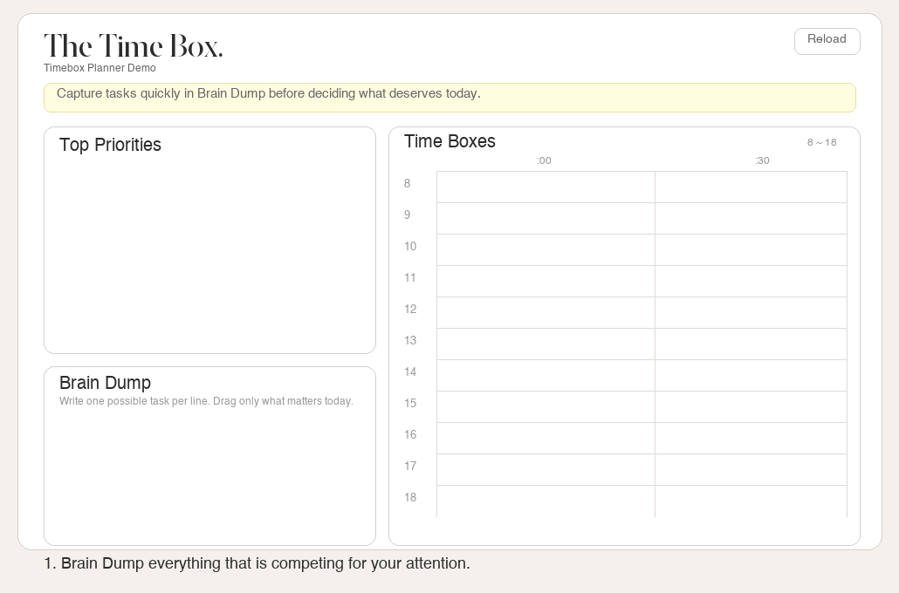
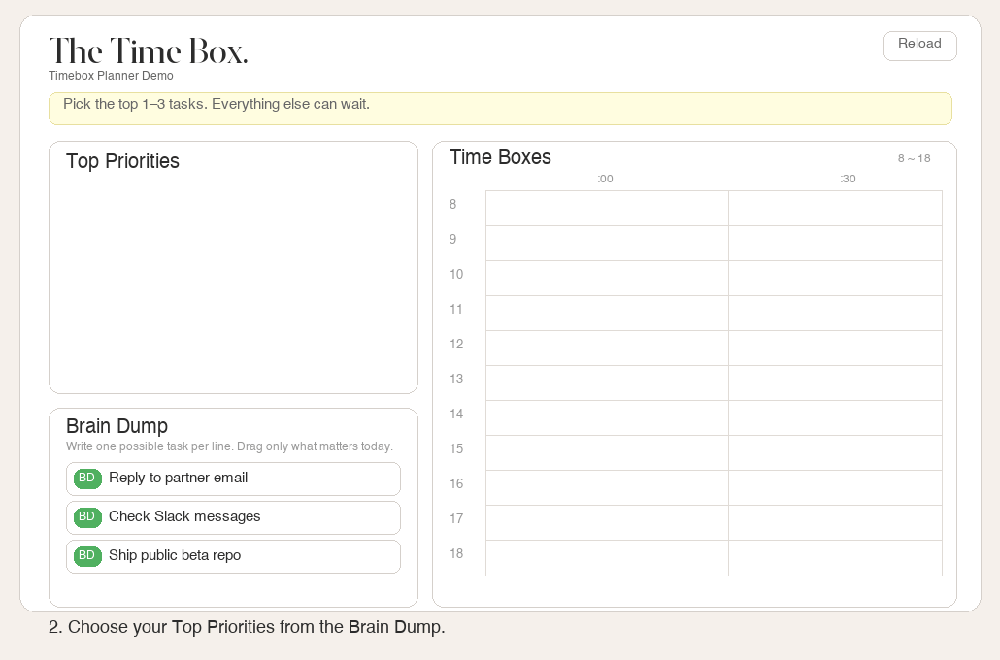
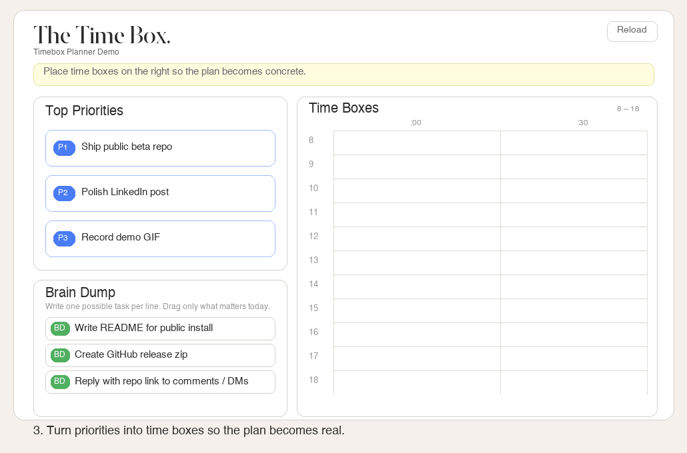

# Timebox Planner

An Obsidian plugin that brings **Brain Dump → Top Priorities → Time Boxes** into your Daily note as a single, unified view. Desktop only.

Instead of opening yet another scheduling app, plan your day right where you already take notes.

## What is Timeboxing?

Timeboxing is a time management method where you **fix the time first, then assign tasks to it** — the opposite of a traditional to-do list.

Elon Musk is well known for using timeboxing to run Tesla, SpaceX, X, and other companies simultaneously. Rather than maintaining an open-ended task list, he designs his schedule around fixed time blocks and focuses on one problem at a time within each block.

### Why To-do Lists Fall Short

A to-do list has no concept of **time**. When 10 items sit on a list, the prefrontal cortex burns energy constantly deciding "which one first?" Research from Columbia University shows that **the more choices you have, the less likely you are to act on any of them** (decision fatigue).

### Why Timeboxing Works

**Zeigarnik Effect → Brain Dump**
The brain keeps replaying unfinished tasks, draining mental energy in the background. Writing everything down signals the brain that it no longer needs to hold on, reducing anxiety and freeing up working memory.

**4 Disciplines of Execution → Big 3**
The more goals you pursue simultaneously, the worse your results. Picking just 3 priorities per day forces focus and dramatically increases completion rates.

**Time Boundary Effect → Timebox**
"Write draft" is vague. "5:30 AM – 7:00 AM: Write draft" is a boundary. Once a task has a concrete time slot, the brain stops deliberating and starts executing. Reactive time and focused time become structurally separated.

### To-do List vs Timeboxing

| | To-do List | Timeboxing |
|---|---|---|
| Core question | "What should I do today?" | "Where should I spend my time?" |
| Prioritization | Gets blurry as the list grows | Forced by finite time |
| Execution | Order is flexible (and often procrastinated) | Fixed start time — just begin |
| Limitation | No idea how long each item takes | Must estimate duration upfront |

## How It Works

### Step 1. Brain Dump

Write down everything on your mind — tasks, worries, ideas. No filtering, no ordering. The goal is to **empty your working memory** so the Zeigarnik effect stops draining you.

### Step 2. Top Priorities (Big 3)

Pick the 1–3 items from Brain Dump that **must** move forward today. The key decision here is not what to do, but **what not to do today**. Drag a Brain Dump card onto a Priority slot to copy it.

### Step 3. Time Boxes

Place your priorities onto 30-minute time slots on the right panel. You can drag cards directly, or select a card then click an empty slot. Blocks can be resized with `+30` / `-30` or moved by dragging.

Once placed, your day's plan is visually locked in. The finite time makes it obvious what doesn't fit.

## Features (MVP)

- Dedicated `Timebox Planner` view inside Obsidian
- `Top Priorities` — 3 editable slots
- `Brain Dump` — add, edit, delete items
- Drag from Brain Dump to Top Priorities
- Drag or click-to-place cards onto 30-min time slots
- Create, move, resize (`+30` / `-30`), and delete time blocks
- Auto-syncs with `## Top Priorities` / `## Brain Dump` sections in the active note
- Human-readable Markdown; machine data stored in hidden HTML comments (`<!-- timebox-planner:data ... -->`)

## Installation

Manual install only (not yet registered as a community plugin).

1. Download the zip from the [Releases page](https://github.com/rathmango/obsidian-timebox-planner/releases).
2. Extract `manifest.json`, `main.js`, and `styles.css` into a single folder.
3. Place the folder at `<YourVault>/.obsidian/plugins/timebox-planner/`.
4. In Obsidian, enable Community Plugins and activate **Timebox Planner**.
5. Open the Command Palette and run `Open Timebox Planner`.

## Data Storage

The plugin stores data inside the active note:

- **Human-readable**: `## Top Priorities`, `## Brain Dump` sections
- **Machine-readable**: `<!-- timebox-planner:data ... -->` HTML comment

Your note stays readable even without the plugin.

## Current Limitations

- Desktop only
- Not yet in the Obsidian community plugin registry
- No settings UI
- No external calendar integration
- MVP stage — actively being refined for daily use

## References

- [To-do list makes things worse — Elon Musk's time management method (Korean)](https://www.youtube.com/watch?v=KVNYJoIbS-c)
- [Elon Musk's Timeboxing Technique (Korean)](https://www.youtube.com/watch?v=kX3EnAayzDo)
- [HBR: How Timeboxing Works and Why It Will Make You More Productive](https://hbr.org/2018/12/how-timeboxing-works-and-why-it-will-make-you-more-productive)

---

## 한국어 안내

Obsidian Daily note 안에서 **Brain Dump → Top Priorities → Time Boxes**를 한 흐름으로 이어주는 데스크톱 전용 플러그인입니다.

일론 머스크가 테슬라, 스페이스X 등 여러 회사를 동시에 운영하면서 활용하는 것으로 알려진 타임박싱(Timeboxing) 기법을, 별도 앱 없이 Obsidian Daily note 안에서 바로 실행할 수 있습니다.

### 3단계 워크플로우

1. **Brain Dump** — 머릿속 할 일을 전부 꺼냅니다 (자이가르닉 효과 해소)
2. **Top Priorities (Big 3)** — 오늘 반드시 밀어야 할 1~3개만 고릅니다
3. **Time Boxes** — 선택한 항목을 시간표에 배치합니다

### 설치

1. [Release 페이지](https://github.com/rathmango/obsidian-timebox-planner/releases)에서 zip 다운로드
2. `manifest.json`, `main.js`, `styles.css`를 `<Vault>/.obsidian/plugins/timebox-planner/`에 배치
3. Obsidian → Community Plugins → **Timebox Planner** 활성화
4. 명령어 팔레트 → `Open Timebox Planner`
